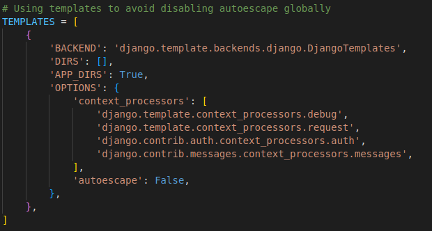

# (Secured) Django Student Management

## Features of this Project

### Admin Users Can
1. See Overall Summary Charts of Stuudents Performance, Staffs Perfomrances, Courses, Subjects, Leave, etc.

2. Manage Staffs (Add, Update and Delete)

3. Manage Students (Add, Update and Delete)

4. Manage Course (Add, Update and Delete)

5. Manage Subjects (Add, Update and Delete)

6. Manage Sessions (Add, Update and Delete)

7. View Student Attendance

8. Review and Reply Student/Staff Feedback

9. Review (Approve/Reject) Student/Staff Leave


## Security features for this Project

### 1. Authentication System


#### https://docs.djangoproject.com/en/4.0/topics/auth/default/

See examples below for full references;
- settings.py
- views.py
- urls.py
- models.py
- LoginCheckMiddleWare.py
- EmailBackEnd.py
- admin.py

### 2. CSRF Protection using Middleware


#### https://www.stackhawk.com/blog/django-csrf-protection-guide/  

See example below for full references;
- settings.py

### 3. XSS Protection using Secure Browser XSS Filter


#### https://www.stackhawk.com/blog/django-xss-examples-prevention/  

See example below for full references;
- settings.py

### 4. Force HTTPS to stop information exchange using Secure SSL Redirect


https://stackoverflow.com/questions/49112365/django-redirecting-http-https  

See example below for full references;
- settings.py

### 5. Hardening Django Production


https://www.digitalocean.com/community/tutorials/how-to-harden-your-production-django-project

See examples below for full references;
- manage.py
- wsgi.py
- .env
- settings.py

### 6. Prevent XSS by avoid disabling autoescape globally



https://www.securecoding.com/blog/guard-django-application-against-cross-site-scripting/ 
https://stackoverflow.com/questions/70785267/does-django-httpresponseredirect-suffer-from-xss-attack  

See example below for full references;
- settings.py

### 7. Protecting Password Validation


https://docs.djangoproject.com/en/3.0/ref/settings/#auth-password-validators

See example below for full references;
- settings.py

### 8. Configuration Management


https://django-configurations.readthedocs.io/en/stable/

See example below for full references;
- .env

### 9. Sensitive Data Prevention using Casting Data & Cryptography


https://studygyaan.com/django/how-to-protect-sensitive-data-in-django
https://django-cryptography.readthedocs.io/en/latest/
https://www.securecoding.com/blog/cryptography-for-security-in-django-app/

See example below for full references;
- settings.py

### 10. Auditing and Logging


https://pypi.org/project/django-field-history/

See example below for full references;
- settings.py

## Features of this Project

### A. Admin Users Can
1. See Overall Summary Charts of Stuudents Performance, Staffs Perfomrances, Courses, Subjects, Leave, etc.
2. Manage Staffs (Add, Update and Delete)
3. Manage Students (Add, Update and Delete)
4. Manage Course (Add, Update and Delete)
5. Manage Subjects (Add, Update and Delete)
6. Manage Sessions (Add, Update and Delete)
7. View Student Attendance
8. Review and Reply Student/Staff Feedback
9. Review (Approve/Reject) Student/Staff Leave

### B. Staff/Teachers Can
1. See the Overall Summary Charts related to their students, their subjects, leave status, etc.
2. Take/Update Students Attendance
3. Add/Update Result
4. Apply for Leave
5. Send Feedback to HOD

### C. Students Can
1. See the Overall Summary Charts related to their attendance, their subjects, leave status, etc.
2. View Attendance
3. View Result
4. Apply for Leave
5. Send Feedback to HOD

## How to Install and Run this project?

### Installation
**1. Create a Folder where you want to save the project**

**2. Create a Virtual Environment and Activate**

Install Virtual Environment First
```
apt install python3.10-venv
pip3 install virtualenv
```

Create Virtual Environment
```
python3 -m venv venv
```

Activate Virtual Environment
```
source venv/bin/activate
```

**3. Clone this project**
```
git clone https://github.com/g3nj1z/secured-student-management-system.git
```

Then, Enter the project
```
$  cd 
```

**4. Install Requirements from 'requirements.txt' and other 'dependencies'.**
```python
pip3 install -r requirements.txt
pip3 install django
pip3 install python-dotenv
pip3 install django-field-history
pip3 install django-sslserver
pip3 install gunicorn
pip3 install psycopg2
```

**5. Add the hosts**

- Got to settings.py file 
- Then, On allowed hosts, Add [‘*’]. 
```python
ALLOWED_HOSTS = ['*']
```

**6. Migrations**
```
python3 manage.py migrate
```

**7. Now Run SSL Server**

```python
python3 manage.py runsslserver
```

**8. Stop Run SSL Server**

```python
deactivate
```

**9. Login Credentials**

Create Super User (HOD)
```
python manage.py createsuperuser
```
Then Add Email, Username and Password

**Default Credentials**

*For HOD /SuperAdmin*
Email: admin@gmail.com
Password: admin

*For Staff*
Email: staff@gmail.com
Password: staff

*For Student*
Email: student@gmail.com
Password: student

## In Progress

### Add staff & student

#### Staff Can
1. See the Overall Summary Charts related to their students, their subjects, leave status, etc.
2. Take/Update Students Attendance
3. Add/Update Result
4. Apply for Leave
5. Send Feedback to HOD

#### Students Can
1. See the Overall Summary Charts related to their attendance, their subjects, leave status, etc.
2. View Attendance
3. View Result
4. Apply for Leave
5. Send Feedback to HOD

### Deploy on Heroku
#### see https://realpython.com/django-hosting-on-heroku/

### adding procfile and runtime.txt
#### see https://stackoverflow.com/questions/69605603/what-should-go-in-my-procfile-for-a-django-application
```
heroku create secured-student-management
cd secured-student-management
heroku git:remote --app secured-student-management
heroku config:set SECRET_KEY='(i#*06f#keydy_fh17bf=$0f6v)^wr^l7*u4gq42m*sztu#2_m'
heroku config:set DISABLE_COLLECTSTATIC=1
heroku buildpacks:clear
heroku buildpacks:add heroku/python
git push heroku master
heroku config:unset PYTHONHOME -a secured-student-management
heroku config:unset PYTHONPATH -a secured-student-management
heroku run python3 manage.py migrate
heroku run python3 manage.py runsslserver
```